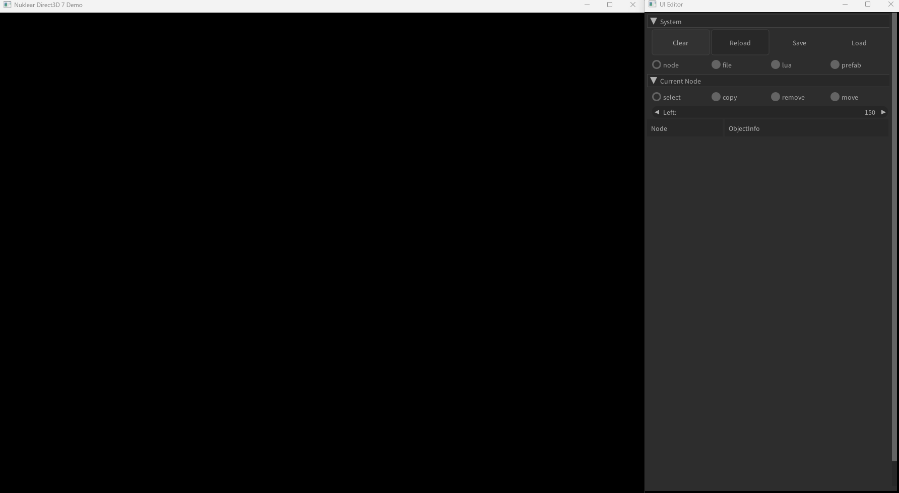
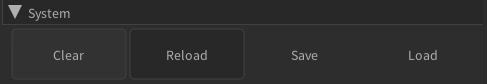
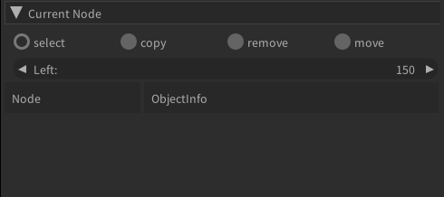
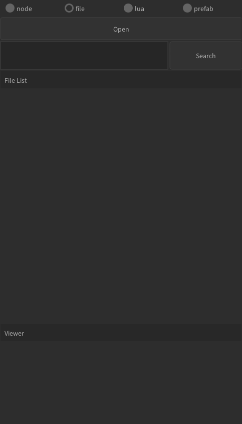
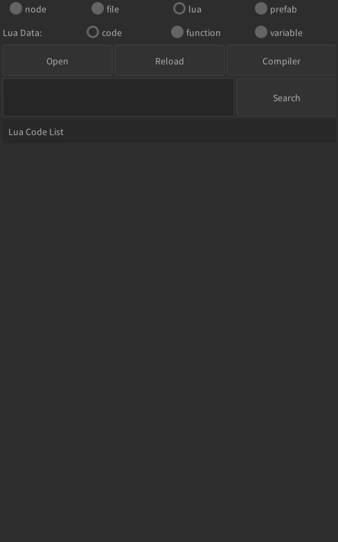
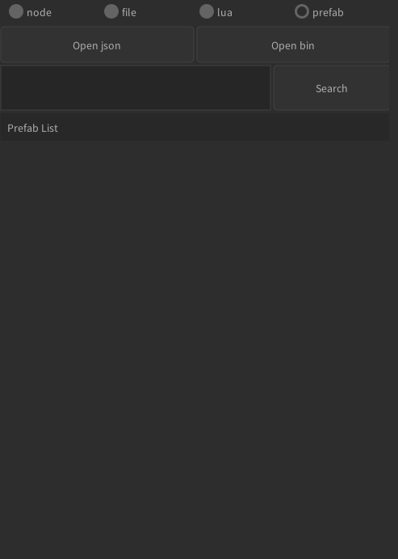

# UI 에디터 가이드

`nkModule`은 UI를 시각적으로 편집할 수 있는 강력한 에디터를 제공합니다. 이 문서는 에디터의 주요 기능과 사용법을 안내합니다. 에디터는 `_NKDEBUG` 매크로가 정의된 디버그 빌드에서만 활성화됩니다.

## 메인 화면 구성

에디터는 크게 **시스템 메뉴**와 **메인 탭**으로 구성됩니다.

### 시스템 메뉴

- **Clear**: 현재 작업 중인 모든 UI 노드와 데이터를 초기화합니다.
- **Reload**: 등록된 모든 Lua 스크립트를 다시 로드하여 변경 사항을 즉시 반영합니다.
- **Save**: 현재 UI 구조를 파일로 저장합니다. `json`과 `binary` 두 가지 형식을 지원합니다.
- **Load**: 저장된 `json` 또는 `binary` 파일을 불러와 UI 구조를 복원합니다.

### 메인 탭

에디터의 핵심 기능들은 네 가지 탭으로 나뉘어 제공됩니다.

- **Node**: UI 요소를 계층 구조로 확인하고 편집합니다. (기본 탭)
- **File**: 이미지 파일(`spr`)을 관리하고 미리 봅니다.
- **Lua**: Lua 스크립트와 UI에 연결된 변수/함수를 관리합니다.
- **Prefab**: 재사용 가능한 UI 요소(프리팹)를 관리합니다.

---

## 1. Node 탭: UI 요소 편집

**Node** 탭은 UI를 구성하는 모든 요소(노드)를 트리 형태로 보여주고, 이를 편집할 수 있는 다양한 도구를 제공합니다.

- **노드 목록**: 현재 UI의 모든 요소를 계층 구조로 표시합니다.
- **노드 조작**:
    - **Select**: 노드를 선택하여 속성을 편집합니다.
    - **Copy**: 선택한 노드를 복사하여 같은 계층에 추가합니다.
    - **Remove**: 선택한 노드를 삭제합니다.
    - **Move**: 노드를 다른 노드의 자식으로 이동시켜 계층 구조를 변경합니다.
- **속성 편집기**: 선택한 노드의 위치, 크기, 색상, 텍스트 등 세부 속성을 편집할 수 있습니다.

> 📄 **상세 설명:** [Node 편집 가이드](./editor/node.md)

---

## 2. File 탭: 이미지 리소스 관리

**File** 탭에서는 UI에 사용될 이미지 파일(`spr`)을 관리합니다.

- **파일 목록**: 불러온 `spr` 파일의 목록을 표시합니다.
- **미리보기**: 목록에서 파일을 선택하면 해당 이미지와 정보를 미리 볼 수 있습니다.
- **파일 관리**: `Open` 버튼으로 새 파일을 불러오거나, `Delete` 버튼으로 목록에서 제거할 수 있습니다.

> 📄 **상세 설명:** [File 관리 가이드](./editor/file.md)

---

## 3. Lua 탭: 스크립트 연동

**Lua** 탭에서는 Lua 스크립트와 관련된 정보를 확인하고 관리합니다.

- **Code**: 프로젝트에 로드된 Lua 스크립트 파일 목록을 관리합니다.
- **Function / Variable**: UI 요소에 연결된 Lua 함수와 변수 목록을 확인하고, 현재 연결 상태를 볼 수 있습니다.
- **컴파일**: Lua 스크립트(`lua`)를 바이트코드(`luac`)로 컴파일하여 릴리즈 환경에서의 성능을 최적화할 수 있습니다.

> 📄 **상세 설명:** [Lua 스크립팅 가이드](./editor/lua.md)

---

## 4. Prefab 탭: UI 프리팹 관리

**Prefab** 탭에서는 자주 사용하는 UI 요소 조합을 프리팹(Prefab)으로 만들어 재사용할 수 있습니다.

- **프리팹 목록**: 저장된 프리팹 목록을 보여줍니다.
- **프리팹 생성**: Node 탭에서 UI 노드를 선택하고 우클릭 메뉴를 통해 `Save Prefab`을 실행하여 프리팹을 만들 수 있습니다.
- **프리팹 사용**: 목록에서 프리팹을 선택하고 `Make` 버튼을 누르면 현재 선택된 노드의 자식으로 프리팹이 생성됩니다.

> 📄 **상세 설명:** [Prefab 사용 가이드](./editor/prefab.md)
