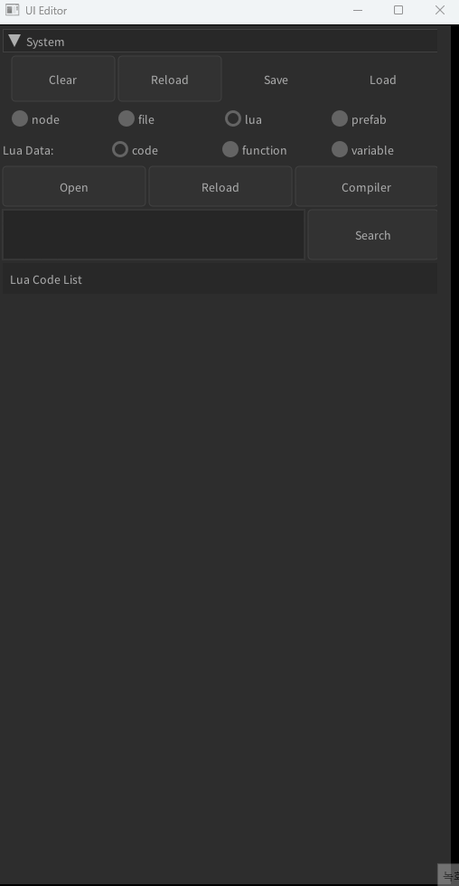
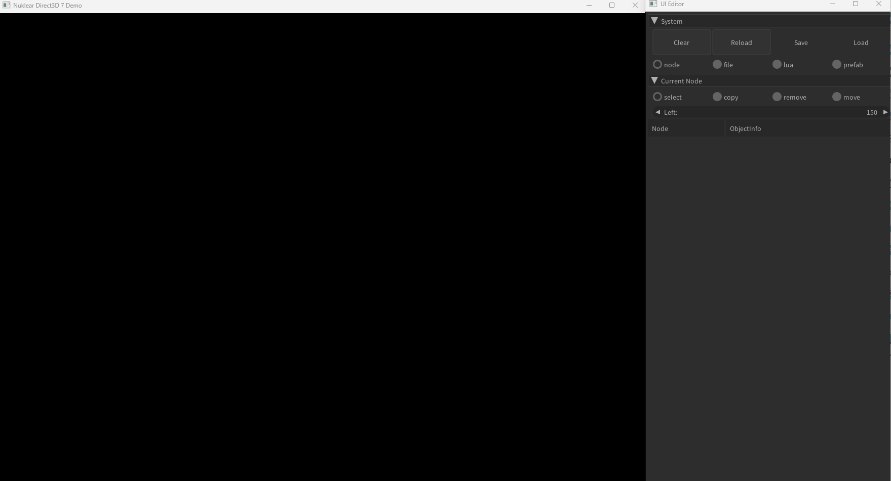

# lua 개요

## luascript
```markdown
function mybutton1()
    print("hello world!!")
end
```

## luascript 로드



## luascript 연결



### 설명
- luascript를 작성하고 파일을 만든다.
- 파일을 위와같이 로드한다.
- window-space-button 순으로 ui를 생성하고 button의 함수이름을 mybutton1로 입력후 enter를 눌러 등록한다.
- 띄워져있는 콘솔창을 활성화하고 button을 눌러 함수에 입력된 문자열이 제대로 출력되는지 확인한다.
