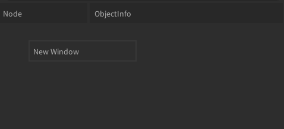
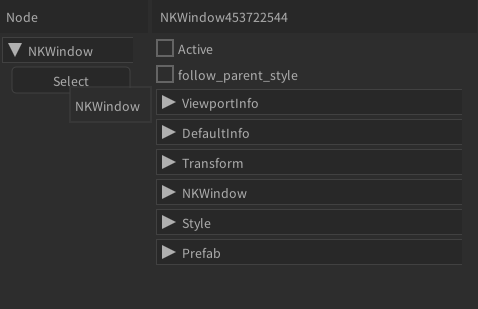
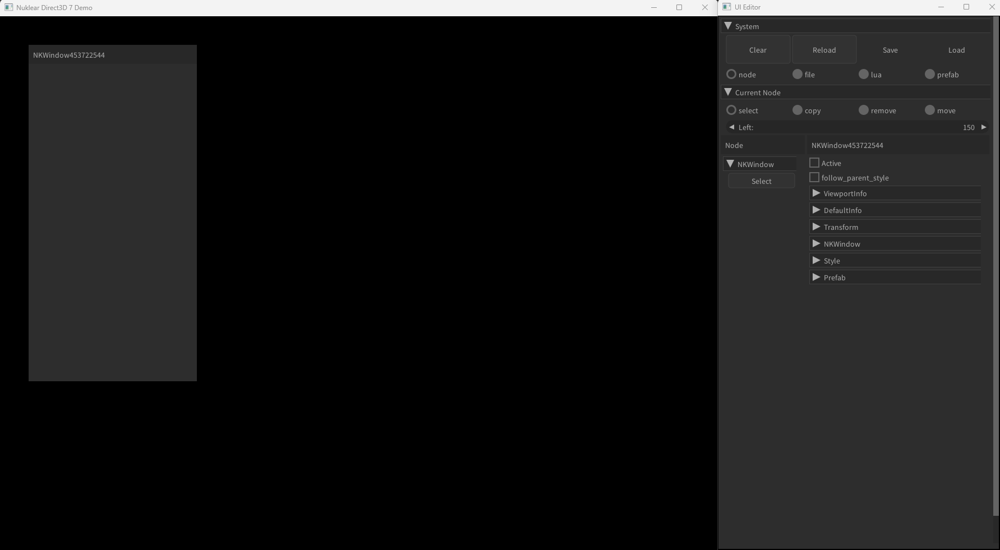
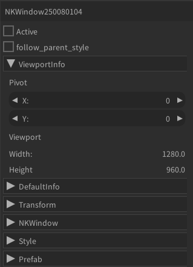
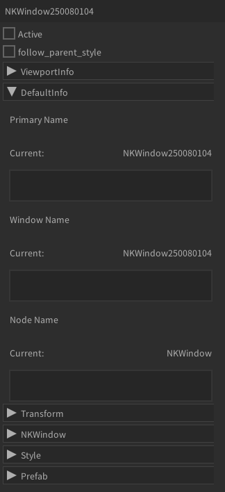
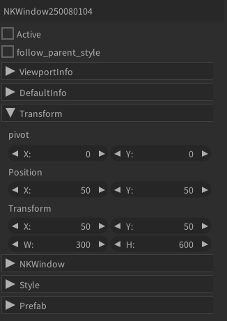
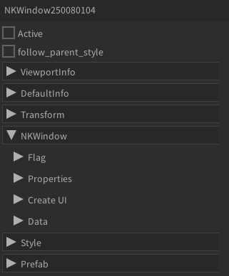
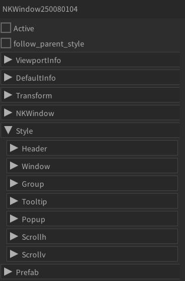
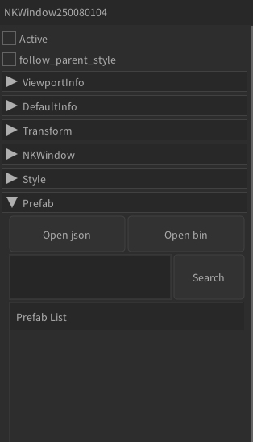

# node 개요

## 예시

#### window 생성

- 마우스 우클릭으로 윈도우를 생성한다.

#### window가 생성된 후 선택된 결과

- Node 옆에 window453722544가 적혀있는 부분은 objectInfo라는 탭이다.

#### 실제 클라이언트의 결과

#### 설명

##### node
- ui system이 관리하는 모든 node가 보여지는 곳이다.
- select, copy, remove, move에 따라 하위 버튼이 달라지며, 노드를 펼쳐놓거나 축소할 수 있다.

##### objectInfo
- select된 node의 모든 정보를 표시해준다.
- objectInfo는 선택된 노드의 WindowName으로 변경된다.

##### Active
- Active로 ui를 활성화&비활성화 할 수 있다.

##### follow_parent_style
- follow_parent_style로 부모 노드의 스타일에 종속되게하거나 체크를 해제하여 독자적인 스타일을 구성할 수 있다.

##### ViewportInfo

- ViewportInfo로 현재 프로세스 해상도 정보를 확인할 수 있다.

##### DefaultInfo

- DefaultInfo로 PrimaryName, WindowName, NodeName 등을 수정할 수 있다. 이때, PrimaryName은 해당 ui노드를 검색할때 사용되며 중복될 수 없다.

##### Transform

- Transform 현재 ui노드의 좌표 x,y와 크기인 width, hegiht를 확인하고 조정할 수 있다.

##### ObjectName(NKWindow, NKSpace ...)

- ObjectName(NKWindow) 각 노드에 해당하는 이름이 위치하며 해당 노드에서만 사용할 수 있는 기능이 내장되어있다.

##### Style

- Style ui노드에 여러 수치 및 color, image등을 제어할 수 있는 기능이다.

##### Prefab

- Prefab 해당 노드의 자식노드로 prefab을 생성할 수 있는 기능이다.

## node list
## 목차
- [Window](node.md#window)
- [Space](node.md#space)
- [Group](node.md#group)
- [Popup](node.md#popup)
- [Combo](node.md#combo)
- [Button](node.md#button)
- [Edit](node.md#edit)
- [Image](node.md#image)
- [Label](node.md#label)
- [ComboItem](node.md#comboItem)
- [Checkbox](node.md#checkbox)
- [Slider](node.md#slider)
- [Progress](node.md#progress)
- [Selectable](node.md#selectable)
- [Tree](node.md#tree)
- [Chart](node.md#chart)
- [Tooltip](node.md#tooltip)
- [Menu](node.md#menu)
- [Scrollbar](node.md#scrollbar)
- [ColorPicker](node.md#colorPicker)
- [SuperStyleObject](node.md#superStyleObject)

## Window
## Space
## Group
## Popup
## Combo
## Button
## Edit
## Image
## Label
## ComboItem
## Checkbox
## Slider
## Progress
## Selectable
## Tree
## Chart
## Tooltip
## Menu
## Scrollbar
## ColorPicker
## SuperStyleObject
