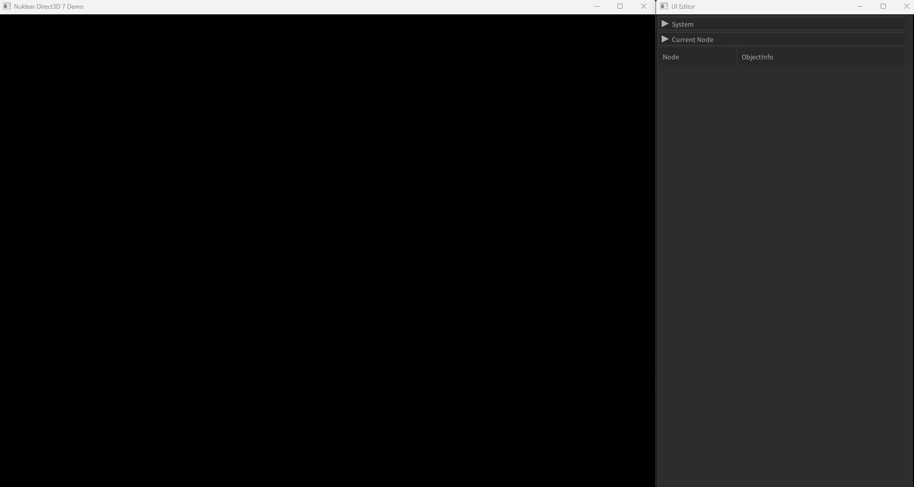

# prefab 개요

## 설명
- prefab은 각각의 노드별로 쪼개서 저장할 수 있는 기능이다.
- 자주 사용할만한 프리셋을 prefab으로 저장한 후 불러와서 사용하면 된다.
- json은 내용을 볼 수 있는 세이브 파일이며, bin은 binary화하여 저장한 세이브파일이다.

## 사용법
- 저장하고 싶은 노드를 선택하고 마우스 오른쪽 키를 눌러 선택하면 된다.
- 선택한 노드의 하위 노드들이 모두 저장된다.
- 모든 ui노드들은 space라는 layout하위에 위치해야 render 함수가 작동된다.
- 노드 하위에 프리팹을 생성하고 싶을때는 원하는 노드를 선택하고 objectinfo에 위치한 프리팹 탭을 이용해 생성하면 된다.
- prefab 상위에 window가 없는 경우. 새로운 window노드를 만든다음 그 하위로 프리팹이 생성된다.
